# AmazonConnect-Extended-HoursOfOperation
Amazon Connectの拡張（オペレーション時間）

## 1 環境

本ドキュメントは、下記が予め利用可能になっている事が前提となっております。

* git/yarn
* AWS CLI
* AWS SAM (samコマンドのみ)
* TypeScript
* VSCode（必須ではありません）

## 2 セットアップ

GitHubからプロジェクトをcloneして下さい。

```
$ git clone https://github.com/furuya02/AmazonConnect-Extended-HoursOfOperation.git
$ cd AmazonConnect-Extended-HoursOfOperation
```
事後の作業は、全てappの中で行います。

```
$ cd app
```

```
[app]$ yarn install
[app]$ cd dst;yarn install;cd ..
[app]$ chmod 755 .vscode/deploy.sh
```

本プロジェクトは、VSCode上で作業すると、快適に作業できるようセットアップされています。

```
[app]$ code . （ <= ドットを忘れないように）
```
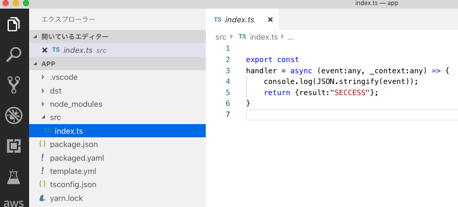

## 3 構成
プロジェクトのファイル構成は、概ね以下のとおりです。

```
├── README.md
├── images
└── app
    ├── dst (js出力)
    |   ├── yarn.lock (デプロイ用)
    |   ├── package.json (デプロイ用)
    |   └── node_modules(デプロイ用)
    ├── src (tsソースコード)
    ├── template.yml (AWS SAM テンプレート)
    ├── tsconfig.json (TypeScript設定)
    ├── yarn.lock (TS用)
    ├── package.json (TS用)
    └── node_modules (TS用)
```

## 4 コンパイル

**tsc**でコンパイルして、jsファイルを生成します。
app/tsconfig.jsonに設定ファイルがあり、これを元にコンパイルすることで、dst/配下にjsファイルが出力されます。

```
[app]$ tsc
```

VSCodeでは、Shift+Cmd+bで表示される選択から、tsc:ウォッチ（常時動作）若しくは、tsc:ビルド（１回のみ）　でコンパイルできます。

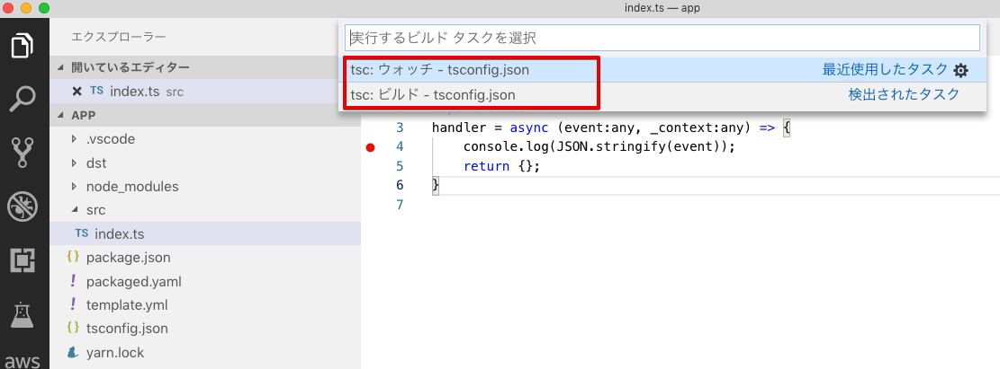


## 5 デプロイ

**sam package**及び、**sam deploy**コマンドでデプロイします。
SAMによるパッケージ作成のために、予め、S3のバケットが必要です。

```
[app]$ export Profile=プロファイル名
[app]$ export BucketName=S3バケット名
[app]$ export StackName=Connect-Extended-Operation-Of-Tiime
[app]$ sam package --output-template-file packaged.yaml --s3-bucket ${BucketName} --p ${Profile}
[app]$ sam deploy --template-file packaged.yaml --stack-name ${StackName} --capabilities CAPABILITY_IAM --p ${Profile} 
```

VSCode上でデプロイするには、Cmd+dで表示される選択から、**deploy**タスクを選択します。

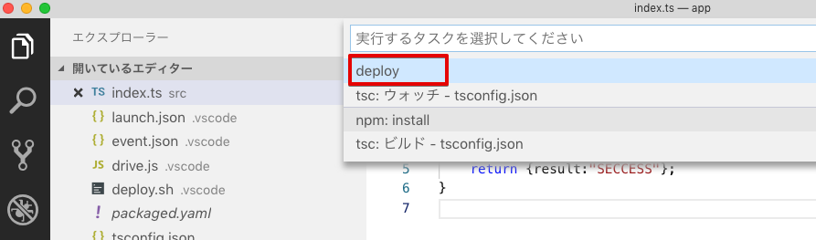

**deploy**タスクは、**.vscode/task.json**で下記のように、**.vscode/deploy.sh**を実行するように設定されています。

```json
{
    "version": "2.0.0",
    "tasks": [
        {
            "label": "deploy",
            "type": "shell",
            "command": ".vscode/deploy.sh",
            "problemMatcher": []
        }
    ]
}
```
パラメータを変更する場合は、**.vscode/deploy.sh**の環境変数の設定を編集して下さい。
```sh
export Profile=プロファイル名
export BucketName=バケット名

#--------------- SAM更新 ---------------------------
export StackName=Connect-Extended-Operation-Of-Tiime

sam package --output-template-file packaged.yaml --s3-bucket ${BucketName} --p ${Profile}
sam deploy --template-file packaged.yaml --stack-name ${StackName} --capabilities CAPABILITY_IAM --p ${Profile} 
```

## 6 リソース

デプロイされるリソースは、以下の3つです。すべてのリソースは、スタック名で始まります。

* S3バケット（設定ファイルのアップロード用）
* Lambda関数
* Lambda用のRole

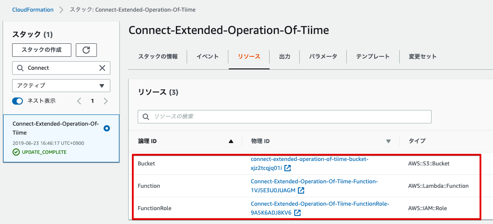

## 7 設定ファイル

設定ファイルをS3バケットにアップロードします
。

バケットは、CloudFormationの出力に表示されているバケット名になります。


```
[app]$ export Profile=プロファイル名
[app]$ export BucketName=バケット名
[app]$ aws s3 cp OperationTime.txt s3://${BucketName}/ --profile=${Profile}
```

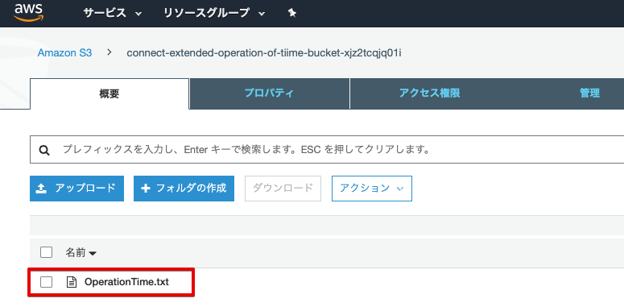


## 8 設置

Amazon Connect のコンタクトフローに適用する手順は、以下のとおりです。


* インスタンスの設定で、**AWS Lambda**関数を追加します。関数名は、CloudFormationの出力で確認して下さい。

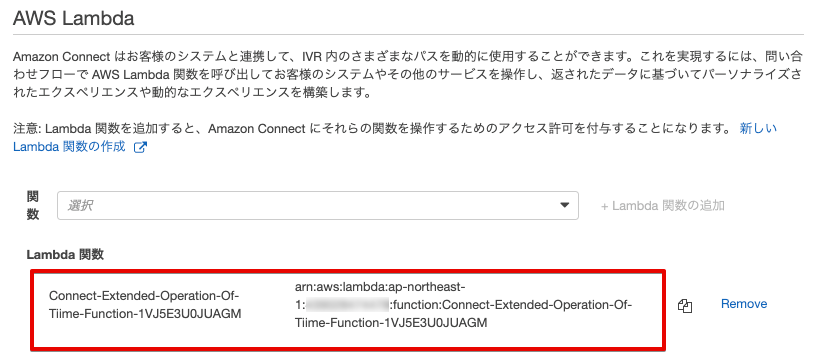

* **AWS Lambda関数を呼び出す**及び、**問い合わせ属性を確認する**のブロックを配置します。

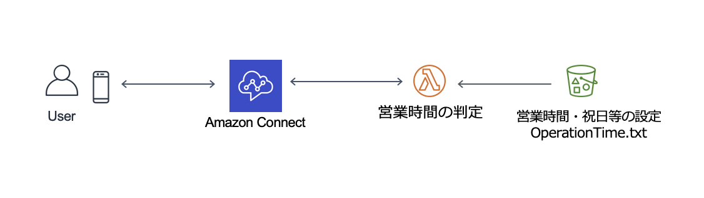

* **AWS Lambda関数を呼び出す**ブロックのオプションで、関数を選択します。


* **問い合わせ属性を確認する**ブロックのオプションで、Lambdaの戻り値で分岐させます。

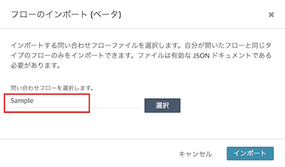

実行すると、Lambdaのログで動作が確認できます。

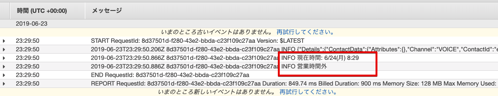


## 9 デバック

VSCodeでは、F5キーを押すことでローカルでデバック実行が可能です。ブレークポイントを指定して、トレースすることもできます。

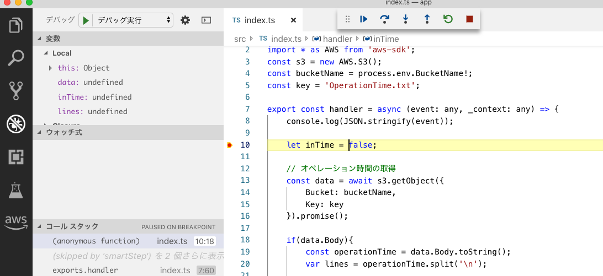

ローカルでデバッグ実行する際の環境変数は、**.vscode/launch.json**で設定します。

**BucketName**にCloudformationの出力（バケット名）を設定して下さい。

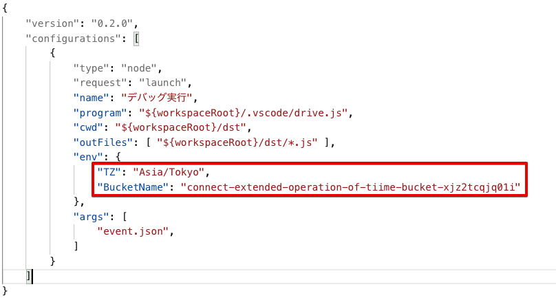
