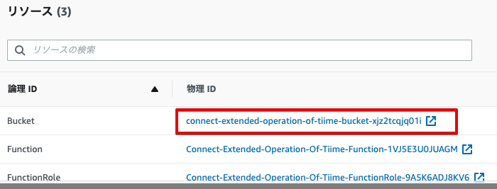
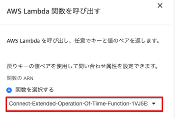

# AmazonConnect-Extended-HoursOfOperation
Amazon Connectの拡張（オペレーション時間）

本ドキュメントは、下記が予め利用可能になっている事が前提となっております。

* git/yarn
* AWS CLI
* AWS SAM (samコマンドのみ)
* TypeScript
* VSCode（必須ではありません）

## 1 概要

Amazon Connectに営業時間内外の判定を行う処理を追加するものです。
S3上の設定ファイル（OperationTime.txt）を編集することで、営業時間、休日等の指定が可能です。


## 2 セットアップ

GitHubからプロジェクトをcloneして下さい。

```
$ git clone https://github.com/furuya02/AmazonConnect-Extended-HoursOfOperation.git
$ cd AmazonConnect-Extended-HoursOfOperation
```
事後の作業は、全てappの中で行います。

```
$ cd app
```
外部モジュールのダウンロード

```
[app]$ yarn install
[app]$ cd dst;yarn install;cd ..
[app]$ chmod 755 .vscode/deploy.sh
```

本プロジェクトは、VSCode上で作業すると、快適に作業できるようセットアップされています。

```
[app]$ code . （ <= ドットを忘れないように）
```


## 3 構成
プロジェクトのファイル構成は、概ね以下のとおりです。

```
├── README.md
├── images (ドキュメント用画像)
├── sample
│   ├── OperationTime.txt (時間設定のサンプル)
│   └── Sample（問い合わせフローのサンプル）
└── app
    ├── dst (js出力)
    │   ├── yarn.lock (デプロイ用)
    │   ├── package.json (デプロイ用)
    │   └── node_modules(デプロイ用)
    ├── src (tsソースコード)
    │   └── index.ts
    ├── template.yml (AWS SAM テンプレート)
    ├── tsconfig.json (TypeScript設定)
    ├── yarn.lock (TS用)
    ├── package.json (TS用)
    └── node_modules (TS用)
```

## 4 コンパイル

**tsc**でコンパイルして、jsファイルを生成します。
app/tsconfig.jsonに設定ファイルがあり、これを元にコンパイルすることで、dst/配下にjsファイルが出力されます。

```
[app]$ tsc
```

VSCodeでは、Shift+Cmd+b（ビルドタスクの実行）で表示される選択から、tsc:ウォッチ（常時動作）若しくは、tsc:ビルド（１回のみ）　でコンパイルできます。


## 5 デプロイ

**sam package**及び、**sam deploy**コマンドでデプロイします。
SAMによるパッケージ作成のために、予め、S3のバケットが必要です。

```
[app]$ export Profile=プロファイル名
[app]$ export BucketName=S3バケット名
[app]$ export StackName=Connect-Extended-Operation-Of-Tiime
[app]$ sam package --output-template-file packaged.yaml --s3-bucket ${BucketName} --p ${Profile}
[app]$ sam deploy --template-file packaged.yaml --stack-name ${StackName} --capabilities CAPABILITY_IAM --p ${Profile} 
```

VSCode上でデプロイするには、Cmd+d（カスタム：タスク実行）で表示される選択から、**deploy**タスクを選択します。


**deploy**タスクは、**.vscode/task.json**で下記のように、**.vscode/deploy.sh**を実行するように設定されています。

```json
{
    "version": "2.0.0",
    "tasks": [
        {
            "label": "deploy",
            "type": "shell",
            "command": ".vscode/deploy.sh",
            "problemMatcher": []
        }
    ]
}
```
バケット名などパラメータの変更は、**.vscode/deploy.sh**の環境変数を編集して下さい。
```sh
export Profile=プロファイル名
export BucketName=バケット名

#--------------- SAM更新 ---------------------------
export StackName=Connect-Extended-Operation-Of-Tiime

sam package --output-template-file packaged.yaml --s3-bucket ${BucketName} --p ${Profile}
sam deploy --template-file packaged.yaml --stack-name ${StackName} --capabilities CAPABILITY_IAM --p ${Profile} 
```

## 6 リソース

デプロイされるリソースは、以下の3つです。すべてのリソースは、スタック名で始まります。

* S3バケット（設定ファイルのアップロード用）
* Lambda関数
* Lambda用のRole


## 7 設定ファイル

設定ファイルをS3バケットにアップロードします
。

バケットは、CloudFormationの出力に表示されているバケット名になります。


```
[app]$ export Profile=プロファイル名
[app]$ export BucketName=バケット名
[app]$ aws s3 cp ../sample/OperationTime.txt s3://${BucketName}/ --profile=${Profile}
```


## 8 設置

本プロジェクトを設置する手順は、以下のとおりです。

* インスタンスへのLambdaの追加
* 問い合わせフローの設置
* **AWS Lambda関数を呼び出す**ブロックの設定

### (1) インスタンスへのLambdaの追加

* インスタンスの設定で、**AWS Lambda**関数を追加します。関数名は、CloudFormationの出力で確認して下さい。


### (2) 問い合わせフローの設置

問い合わせフローのサンプル(sample/Sample)をインポートします。


### (3) **AWS Lambda関数を呼び出す**ブロックの設定

* **AWS Lambda関数を呼び出す**ブロックのオプションで、関数を選択します。



動作の状況は、Lambdaのログで確認が可能です。


## 9 設定

設定要領は、曜日ごとの営業時間及び、休日の２種類あります。

### (1) 曜日ごとの営業時間
カンマ区切りで下記のとおり

```
曜日,始業時間,就業時間
```

### (2) 休日
１行に１件で設定

```
月/日
```
なお、空行や、#以降（コメント）は、無視されます。

**OperationTime.txt**
```
月,09:00,19:00
火,09:00,19:00
水,09:00,19:00
木,09:00,19:00
金,09:00,19:00

1/13 # 会社の創立記念日

1/1　#元旦
1/8　#成人の日

# 2/11 #建国記念日
2/12 #建国記念日(振替)

3/21 #春分の日

# 4/29 #昭和の日
4/30 #昭和の日(振替)

5/3 #憲法記念日
5/4 #みどりの日　
5/5 #こどもの日

7/16 #海の日

8/11 #山の日

9/17 #敬老の日（9月第三月曜日）
# 9/23 #秋分の日
9/24 #秋分の日(振替）

10/8 #体育の日

11/3 #文化の日
11/23 #勤労感謝の日
# 12/23 #天皇誕生日
12/24 #天皇誕生日(振替)
```


## 10 デバック

VSCodeでは、F5キーを押すことでローカルでデバック実行が可能です。ブレークポイントを指定して、トレースすることもできます。


ローカルでデバッグ実行する際の環境変数は、**.vscode/launch.json**で設定します。

**BucketName**にCloudformationの出力（バケット名）を設定して下さい。


